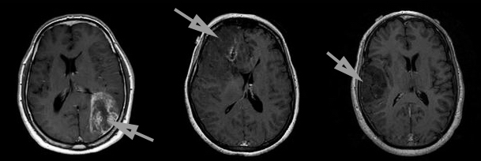
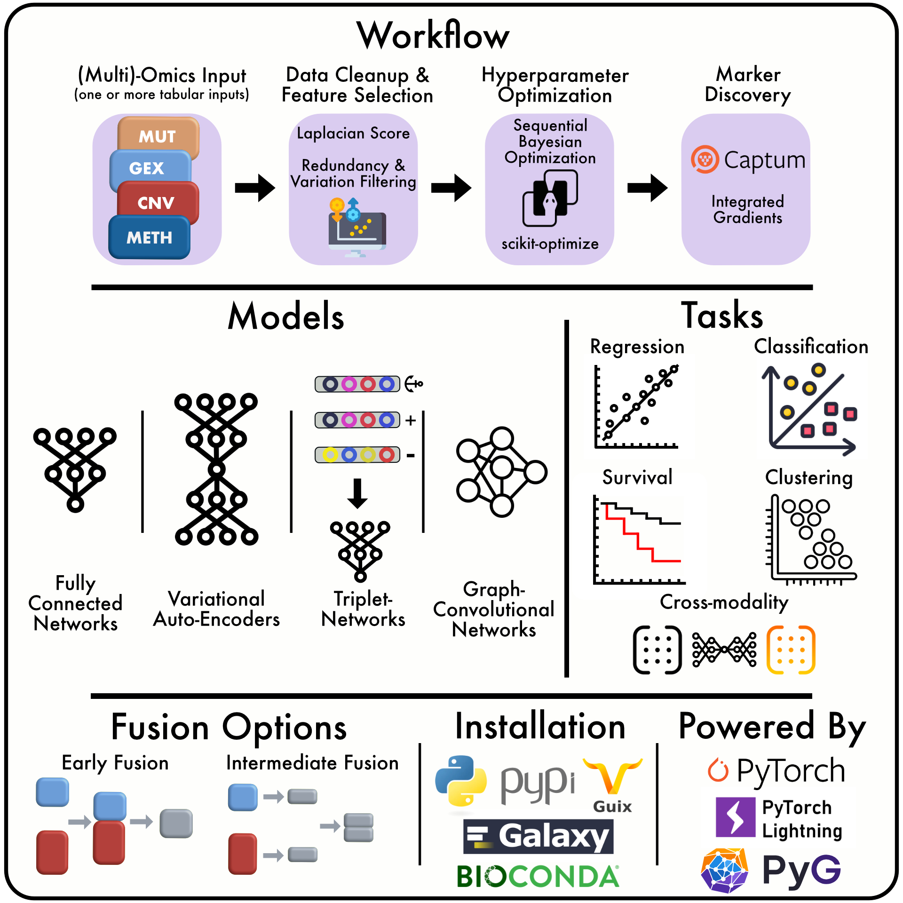

# Survival Associated Markers Discovery in Lower Grade Glioma (LGG) and Glioblastoma Multiforme (GBM) using Flexynesis

Lower Grade Glioma (LGG) and Glioblastoma Multiforme (GBM) are primary brain tumors that arise from glial cells. LGG is a slow-growing tumor with a variable prognosis, while GBM is an aggressive, high-grade glioma with poor survival rates. Due to their complex molecular profiles, identifying survival-associated biomarkers is crucial for advancing precision medicine and improving patient outcomes.

<p align="center">
  
</p>

Aaron Cohen-Gadol, M. D. (2024, October 4). Low-grade glioma: Expert surgeon. Expert Surgeon | Aaron Cohen-Gadol, MD. https://www.aaroncohen-gadol.com/en/patients/glioma/types/low-grade 

<br> <br>
This project aims to discover key survival markers in LGG and GBM using Flexynesis, a deep-learning-based multi-omics data integration framework.


**Flexynesis Framework Documentation by Akalin lab**   
([https://doi.org/10.1109/iementech60402.2023.10423520](https://github.com/BIMSBbioinfo/flexynesis))


## Dataset
Source on cBioPortal - for cancer genomics:
[Merged Cohort of LGG and GBM (TCGA, Cell 2016)]([https://www.kaggle.com/datasets/pkdarabi/bone-fracture-detection-computer-vision-project](https://www.cbioportal.org/study/summary?id=lgggbm_tcga_pub))


## Project Overview
The project follows these steps:
- Dataset Loading
- Exploratory Data Analysis
- Explore Sample Annotations
- Automating the Hyperparameter Optimisation
- PCAs
- Survival-risk subtypes
- Comparing top markers with clinical covariates
- Get the top 10 markers
  

## Model Training Configuration
The model was trained using the following configuration:
- **Dataset**: Merged Cohort of LGG and GBM (TCGA, Cell 2016)
- **Epochs**: 35
- **Batch Size**: 32


## Results
Key top 10 Survival Associated Markers:

| Gene Marker | Full Name                          | Function & Role in Cancer | Association with LGG/GBM |
|------------|-----------------------------------|---------------------------|---------------------------|
| **DH1**    | Dihydrouridine Synthase 1        | RNA modification enzyme affecting translation regulation. | Under investigation in glioma progression. |
| **ATRX**   | Alpha Thalassemia/Mental Retardation Syndrome X-Linked | Chromatin remodeling, telomere maintenance. | Frequently mutated in LGG, linked to better prognosis. |
| **EGFR**   | Epidermal Growth Factor Receptor | Promotes tumor cell proliferation via RTK signaling. | Amplified in GBM, associated with poor survival. |
| **NF1**    | Neurofibromin 1                   | Tumor suppressor, Ras signaling regulator. | Mutations contribute to aggressive glioma subtypes. |
| **MUC16**  | Mucin 16, Cell Surface Associated | Mucin involved in immune evasion. | Emerging biomarker in glioma prognosis. |
| **CIC**    | Capicua Transcriptional Repressor | Tumor suppressor, regulates oncogenic pathways. | Mutations linked to poor prognosis in LGG. |
| **TP53**   | Tumor Protein p53                 | Key tumor suppressor, regulates apoptosis. | Mutations common in gliomas, affecting treatment response. |
| **IDH2**   | Isocitrate Dehydrogenase 2        | Metabolic enzyme, epigenetic regulator. | IDH mutations associated with better prognosis in LGG. |
| **PIK3CA** | Phosphatidylinositol-4,5-Bisphosphate 3-Kinase Catalytic Subunit Alpha | Key player in PI3K/AKT/mTOR pathway. | Mutations drive glioma growth, linked to therapy resistance. |
| **SVIL**   | Supervillin                       | Actin-binding protein, involved in cytoskeleton dynamics. | Potential role in glioma cell invasion. |

### Notes:
- This table summarizes potential survival-associated markers in **LGG and GBM**.
- Further validation and clinical interpretation are necessary for therapeutic applications.


## Installation and Usage
To run the model, ensure you have the necessary dependencies installed:
```sh
!pip install pycox torchtuples
```

```sh
mamba create --name flexynesisenv python==3.13.1
```
For training and evaluation, follow the provided scripts in the repository.

## Conclusion
This project demonstrates the effectiveness of Flexynesis in multi-omics in precision oncology. High precision and recall indicate its potential for clinical applications.

## License
**Copyright (c) 2025 Abdullah Elafifi**
